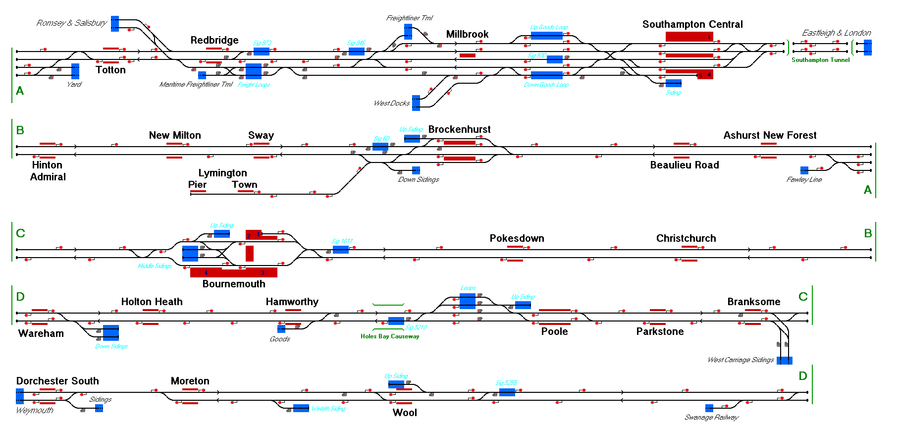

# South West Main Line
The South West Main Line from Southampton Central to Dorchester South

## Current Status

| Stage         | Status        |
| ------------- |:-------------:|
| Track Plan     | :heavy_check_mark: |
| Signalling      | :heavy_check_mark:      |
| Naming | :heavy_check_mark:      |
| Speed Limits | :heavy_check_mark: |
| Distances | :heavy_check_mark: |
| Timetable | :heavy_check_mark: |
| Documentation | :heavy_check_mark: |

## Data Sources

- RealTimeTrains
- OpenRailwayMap
- Traksy
